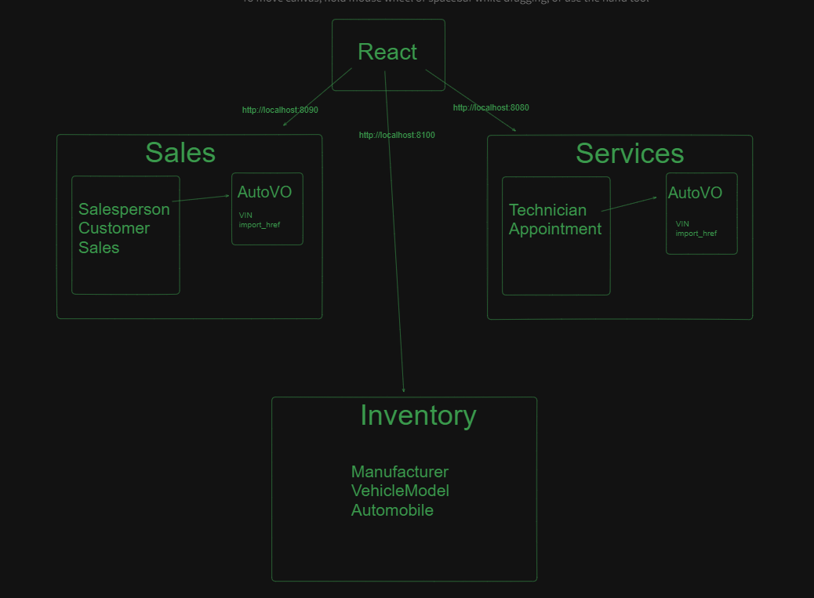

# CarCar

## Team

- Michaela Arteberry - Service
- Justin Cosby - Sales

## Design

### Service Microservice

Below are the models and how they are interacted with:

1. Technician Model: Represents the technician responsible for servicing the automobiles.
    - Fields: first_name, last_name, employee_id.

2. Appointment Model: Represents the appointment and time slot for the automobile to receive service.
    - Fields: customer_name, vin, vip, date, time, technician, reason, status.

#### How it works with the Inventory Microservice

- Creation and Update: Appointments can be created or updated.
- Automobile Existence Check: Automobile existence can be checked using the VIN from the inventory microservice.
- VIP Marking: Vehicles can be marked as VIP based on whether they have been sold or not.

## Bounded Contexts

In the microservice for Automobile Service, a specific Bounded Context called "Service Appointment Management" has been established to oversee the entire lifecycle of appointments for automobile servicing. This distinct context consolidates all functions related to managing service appointments, enhancing organizational clarity and the separation of concerns within the microservice architecture. By confining appointment-related processes within this context, maintaining and expanding the service becomes more efficient, minimizing the risk of impacting other system elements.

## Value Objects

Within the confined realm of Service Appointment Management, the Technician and Appointment objects function as value entities embodying core concepts in the domain. Technicians encapsulate data about individuals responsible for automobile servicing, including their names and employee IDs. Appointments encapsulate details about scheduled service appointments, such as customer information, appointment date and time, assigned technicians, and appointment status. By modeling these entities as value objects, we ensure their immutability and self-containment, facilitating clearer comprehension and management of appointment-related operations within the service microservice. Additionally, the AutomobileVO entity represents an Automobile Value Object fetched from the Inventory microservice, containing essential information about automobiles in the system.

## Urls used in Service Microservice

### Sales Microservice

We created Value Objects for each model in the inventory microservice, which then assist us in our sales and service api(back-end). These models are used to create and display the information on our web browser(front-end).
